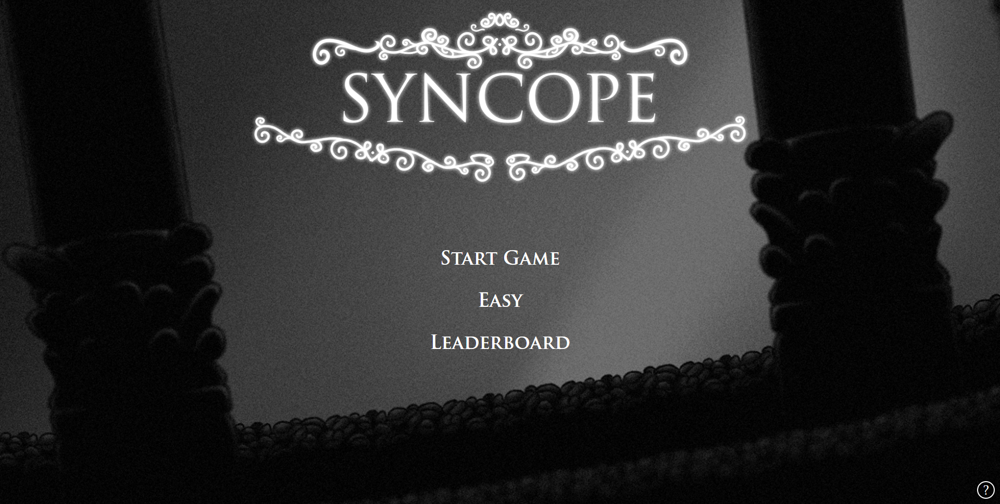
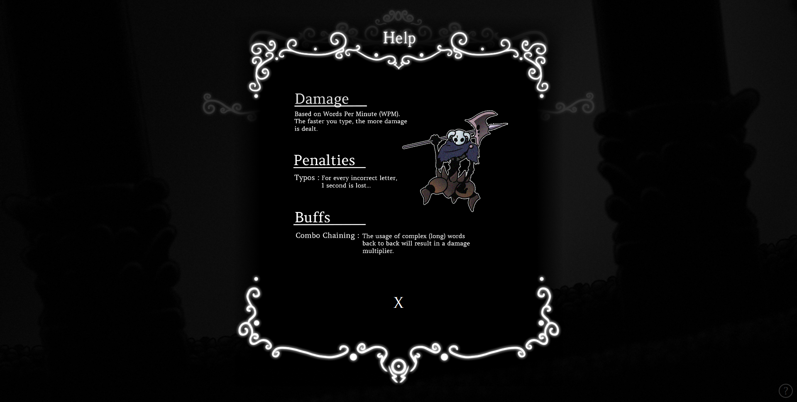

  

# Syncope
**/ˈsɪŋkəpi/** : The omission of sounds or letters from within a word.

Do you like fighting virtual enemies and typing on your keyboard?  
Syncope is the perfect game for people of all ages like yourself!  
It is a typing game merged with a boss battle elememts where a user would be given a selection of words to type out, and based on the complexity, category, and speed at which you type the words, will detemine the amount of damage dealt onto the enemy!

Site Deployment : [Click Me!](https://jimmy-lew.github.io/IDAssignment2/)
## Design Process

We went with a **2-Dimensional** (2D) based art style as it was simplier to create and draw within a short amount of time and Jimmy is experienced with making 2D art work while Addison is "experienced" with making 8-bit electronic music.
We chose a mainly **black and white** colour theme as we wanted it to have a classic/retro vibe.

### User Stories :

- As a **Student**, I want to have fun while learning new english words.
- As a **Foreigner**, I want to learn english how to type english words on a keyboard.

### Wireframe :
Link to **Wireframe** : [Adobe XD](https://www.google.com)

## Features

### Existing Features

- **Word Prediction** - Automatically predicts which word (out of the 3) the user is typing
- **swAL** - Custom popup that pauses the Javascript Execution until popup is interacted with
- **Leaderboard** - "real-time" leaderboard that displays the top few players who have completed the levels the fastest
- **Secret Code Generator** - Generates a random set of strings 
- **Regex Checks** - Validation for username and Word API words

### Features Left to Implement

- To Add More Levels
- Enemy Health Scaling
- Random Mode (When have enough time for more ART assets and Audio)
- Player Mana
- ...

## Technologies Used

- [HTML](https://developer.mozilla.org/en-US/docs/Web/HTML)
  > The project uses **HTML** to construct the HTML document for the site.

- [JQuery](https://jquery.com)
  > The project uses **JQuery** to simplify DOM manipulation.

- [JavaScript](https://www.javascript.com/)
  > The project uses **JavaScript** to add functionality to the website.

- [SASS](https://sass-lang.com/)
  > The project uses **JQuery**, a powerful CSS extension language for styling

- [CSS](https://developer.mozilla.org/en-US/docs/Web/CSS)
  > The project also still uses **CSS** for styling (mostly overriden by SASS to be recompiled back to CSS)

## Preview Screenshots

### Desktop/Laptops
> 
> 
> 
> 
> 
> 

---

Mobile

>> Heads Up :: Responsiveness was not mentioned in the Assignment Documentation, however, we added some bare minimum functionality and support for mobile.  
-- To be Updated Once Completed --

---

  

## Development

Development Documentation

### Coding Conventions

Naming Conventions ...

    
| Type                                                         | Apply                                                        |
| ------------------------------------------------------------ | ------------------------------------------------------------ |
| camelCase                                                    | Variable name                                                |
| Formal (like camelCase but first capital must be upper case, etc., MyName) | Class name Class Properties Function Name Asset File Name Folder Name |

---

Prefix ...

For Boolean type variable put 'is', 'has' related word in front of the variable name, etc., IsComplete, IsRequire, hasOrder, hasTicket.

  

### Testing
1. Starting as a New user (Username Restrictions + Generate Secret Code)
   - Start Game
   - Help Menu will be displayed
   - Enter a valid username (only alphabets)
   - Defeat enemy
   - Leaderboard score will be pushed, new user created.
   - A secret code would be generated for the user (6 chars long)
  
1. Updating Personal score
   - Start Game
   - Override previous game (optional)
   - Defeat enemy
   - Submit time to leaderboard (yes)
   - If current time is better (faster) than leaderboard, User would be prompted to enter the secret key (given when creating a user)
   - If key is incorrect, user will be prompted if they would like to try again. (no = return to main menu)
   - If key is correct, time will be updated. 
  
1. Gameplay
   - Start Game
   - Override previous game
   - Typing a letter that corresponds with one of the letters will cause the word to be "selected" (based on auto prediction)
   - The letters of the selected word would be highlighted as the user continues to enter the correct characters (in correct sequence + case sensitive)
   - There will be a penalty (time reduction of 1s) for every typo made by the user
  
4. Leaderboard
   - Click on leaderboard in main menu
   - Leaderboard would appear in the middle of the screen
   - Top 10 players would be displayed (Filtered based on different difficulty)
   - Close the leaderboard
   - Select a different difficulty in the main menu & press leaderboard
   - Leaderboard should filter and show 
   - Spam the leaderboard button again
   - Leaderboard should be fine and should not updated/append anymore after the first initalization.

### Bugs / Problems
- **[!]** API Randomly Goes down at midnight (Usually 2am - 9am) 
- [Fixed] Javascript Async -- Functions would run without waiting for API Response to finish and returns null.
- [Partially-Fixed]swAL.js delay
- Long loading times to get restDB Data

## Credits

### Contributions

Jimmy Lew (Mainly Front-End)

- > index.html  
- > menu.html  
- > game.html  
- > CSS Files  
- > SASS Files  
- > disableZoom.js
- > * JS Code Cleaner (Helps to Simplify & Clean Up JS Functions) [Mostly after Addison Implements Functions]  
- > SWAL.js  
- > menu.js (Everything except sound part)  
- > LocalStorage.js  
- > ComboChaining (Assisted Addison: attack.js)  
- > Helped with .json files  
- > Artist & Art Designer

---

Addison Chua (Mainly Back-End)

- > api.js  
- > attack.js  
- > DOMInteraction.js  
- > main.js  
- > leaderboard.js + HTML  
- > menu.js (Audio part + Username Regex Check)  
- > enemy.js  
- > player.js  
- > bosses.json  
- > levels.json  
- > LocalStorage.js (Assisted Jimmy : TimeElapsedStorage + Modified getLevelJSON)  
- > Helped with DefineWordTime (localStorage.js)  
- > Wireframe Designs (Both High Fidelity & Low Fidelity)  
- > README.md  
- > Assist Jimmy In Front End  
- > Music / Audio Producer    

Live Wakatime Contribution (Last 30 Days) : https://wakatime.com/@NotAddison/projects/sdydmimyop?start=2022-02-11&end=2022-02-17  
Archive Wakatime Contribution : https://drive.google.com/drive/folders/1szsa-S51ETz_gtX2W-BSd1x1jUNpwxrk?usp=sharing  

---

  

### Content
* NO Text Content Was Copied From Any External Source

### Media
* **ALL ART ASSETS** were done by : **Jimmy Lew**
* **ALL AUDIO ASSETS** were done by : **Addison Chua**

### API

- [Mc Naveen Random Word API](https://github.com/mcnaveen/Random-Words-API) - Used to generate random english words with definitions.

### Acknowledgements

- [MonkeyType](https://monkeytype.com/) - WPM Calculator to test how fast a user can type
- [TypeRacer](https://play.typeracer.com/) - A competitive typing game where the user with the highest WPM wins a race
- [Hollow Knight](https://static.wikia.nocookie.net/essentialsdocs/images/7/70/Battle.png/revision/latest?cb=20190219202514) - Inspiration for artstyle
